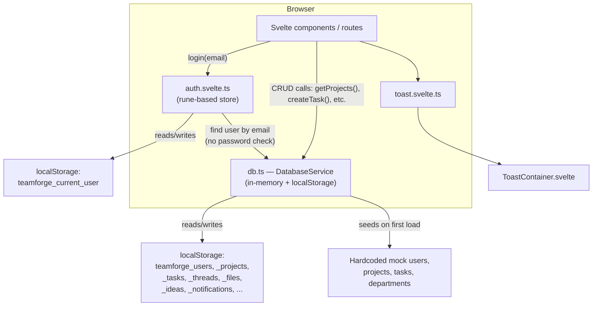

# TeamForge — Project Pipeline & Architecture

> **What this is**: TeamForge is a SvelteKit web app pitched as an "Intelligent Project Team Finder & Collaboration Platform" for university capstone/project courses. It supports three roles — **student**, **faculty**, **admin** — each with their own dashboard for forming teams, tracking project work (Kanban, milestones, weekly reports), and faculty supervision (approvals, reviews, analytics, announcements).
>
> This document describes the **current implemented state** of the codebase (as of the `mouly` branch, commit `32b5e37`), then lists what's missing or stubbed, and closes with a prioritized list of features/work to implement next.

---

## 1. Tech stack

| Layer | Choice | Status |
|---|---|---|
| Framework | SvelteKit 2 + Svelte 5 (runes mode) | ✅ in use |
| Styling | Tailwind CSS v4 | ✅ in use |
| Icons | lucide-svelte | ✅ in use |
| Landing-page animation | GSAP + Lenis (smooth scroll) | ✅ in use, landing page only |
| 3D graphics | three.js | ⚠️ installed, **zero usage** anywhere |
| Schema validation | zod | ⚠️ installed, **zero usage** anywhere |
| Backend / DB | Firebase (`firebase` package) | ⚠️ installed, **not initialized or imported anywhere** |
| Actual data layer | Hand-rolled `localStorage` mock (`src/lib/services/db.ts`) | ✅ this is what the app actually runs on |
| Auth | Hand-rolled, password-less mock (`src/lib/stores/auth.svelte.ts`) | ✅ this is what the app actually runs on |
| Server API | None — no `+server.ts` endpoints exist | ❌ not implemented |

**Key gap to understand before touching this codebase**: the `package.json` dependencies (`firebase`, `zod`, `three`) describe an *intended* architecture that was never wired up. Everything currently runs client-side against fake data seeded into `localStorage`. Any change that assumes a real backend exists will not work until that backend is actually built.

---

## 2. Current data flow (as implemented today)



There is no network request in this app today beyond static asset loading — everything is synchronous, in-browser, and per-device (data does not sync across browsers/devices, and clearing site storage wipes the whole app state).

---

## 3. Route map

```
/                                    Public landing page (GSAP/Lenis hero, feature grid, stats, CTA)
/auth                                Combined Sign In / Create Account (Tabs), quick-demo-profile buttons
/dashboard                           Role-based redirect stub → /dashboard/{student|faculty|admin}

(dashboard) layout                   Sidebar + topbar + notification drawer shell, guards on auth.user

/dashboard/student                   Student overview (teams/tasks summary, create-project dialog)
/dashboard/student/team-finder       Teammate Finder (search/browse students by name or skill)
/dashboard/student/ideas             Project Idea Board (browse/create/edit ProjectIdea entries)
/dashboard/student/profile           Edit profile (bio, skills, interests, availability)
/dashboard/student/project/[id]      Project workspace: Overview & Milestones, Kanban Tasks,
                                      Discussion Board, File Manager (mock), Weekly Reports,
                                      Feedback & Timeline, invite teammates by email

/dashboard/faculty                   Faculty overview (supervision summary)
/dashboard/faculty/approvals         Approve/reject/request-changes on project proposals
/dashboard/faculty/milestones        Assign deliverables, extend deadlines, lock milestones
/dashboard/faculty/reviews           Review weekly reports, approve/request revision
/dashboard/faculty/analytics         Milestone completion / task allocation / contribution analytics
/dashboard/faculty/meetings          Schedule review meetings, categorized quality feedback
/dashboard/faculty/announcements     Broadcast to all teams or specific project teams
/dashboard/faculty/notes             Private per-project/per-student evaluation notes
/dashboard/faculty/reports           Reports hub (generate/export evaluation reports)

/dashboard/admin                     Platform administration, department management
```

**Route guarding today**: `(dashboard)/+layout.svelte` only checks that *someone* is logged in (`auth.user` truthy) — it does **not** check that the logged-in user's role matches the sub-route being visited. A student can currently navigate directly to `/dashboard/faculty/notes` and it will render. There is also no server-side (`hooks.server.ts` / `+layout.server.ts`) enforcement at all — all guarding is client-side and by URL convention only.

---

## 4. Core data models (`src/lib/services/db.ts`)

`User`, `Project`, `ProjectMember`, `Milestone`, `WeeklyReport`, `CategorizedFeedback`, `Meeting`, `Announcement`, `FacultyNote`, `ProjectIdea`, `Task` (+ `TaskComment`, `TaskAttachment`), `Thread`/`Reply`, `ProjectFile`, `Department`, `Notification`.

These are plain TypeScript interfaces, not zod schemas — there is no runtime validation of any of this data (e.g. a malformed object written into `localStorage` by hand would silently break the UI).

---

## 5. Reusable UI layer

Small hand-built design system in `src/lib/components/ui/`: `Badge`, `Button`, `Card`, `Dialog`, `Tabs`, plus a global `ToastContainer`. Styled via Tailwind v4 theme tokens in `src/routes/layout.css` (light/dark via a `.dark` class). No third-party component library.

---

## 6. Gaps between "declared stack" and "actual implementation"

These are not bugs so much as unfinished scaffolding — flagging them so future work targets the right layer:

1. **Firebase is not wired up at all.** No `src/lib/firebase.ts`, no `initializeApp`, no `getAuth`/`getFirestore` calls anywhere. The dependency is currently dead weight. *(Still true — out of scope per current decision, see §7b.)*
2. ~~Auth has no real security.~~ **Fixed.** `AuthStore.login()`/`register()` now hash passwords (SHA-256 via Web Crypto) and verify them; the login form requires a password. Still a client-only mock (no server, no salt/bcrypt) — fine for a demo, not for production.
3. **No server-side authorization.** ~~Role checks are purely cosmetic~~ — role checks are now enforced client-side (per-role `+layout.svelte` guards redirect mismatched roles away), but there is still no server-side enforcement; a user who bypasses the client entirely (e.g. edits `localStorage` directly) isn't stopped by anything. Real enforcement still requires the backend work in §7b.
4. **No API layer.** Zero `+server.ts` files — nothing here could work in production against multiple real users/devices, since state lives only in one browser's `localStorage`.
5. ~~File uploads are fake.~~ **Fixed.** The project workspace File Manager now stores real file bytes in IndexedDB (`src/lib/services/fileStorage.ts`) and downloads round-trip actual content, not just metadata. Still local-only (no cloud storage, no cross-device sync) — that part is still §7b.
6. **zod is now used** (schema validation at the `db.ts` storage boundary) — no longer dead weight. ~~three.js is still an unused dependency~~ **Removed** — it was never imported anywhere, so it was uninstalled (`npm uninstall three @types/three`) rather than left as dead weight or built out speculatively.
7. ~~No tests~~ **Fixed.** Vitest is wired up (`npm test`); 17 unit tests cover `db.ts` CRUD + schema-validation fallback, the compatibility-scoring algorithm, and password hashing/verification.
8. ~~No branding assets~~ **Mostly fixed.** Custom "TF" monogram favicon (`src/lib/assets/favicon.svg`, matches the in-app badge treatment), `static/manifest.webmanifest`, and a `theme-color`/description meta tag. Still missing: a raster OG image for social link previews (not attempted — needs an actual image-rendering step, not just markup).
9. ~~Duplicate redirect logic~~ **Fixed.** Both call sites now use the shared `getDashboardRoute()` helper in `src/lib/utils/navigation.ts`.

---

## 7. Recommended pipeline — **current scope: no Firebase/Firestore work**

Decision: backend migration is explicitly out of scope for now. Everything below stays inside the existing `localStorage` + client-only architecture. Firebase-dependent work is pushed to §7b so it isn't lost, but it is **not** the next thing to build.

### Stage A — Close real holes in the current architecture (no backend needed) — ✅ done
- [x] **Enforce role-based route access client-side.** `dashboard/{student,faculty,admin}/+layout.svelte` guards redirect a mismatched role away with a toast.
- [x] **Make the mock login actually check the password.** SHA-256 hashing via `src/lib/utils/password.ts`, wired into `AuthStore`. Demo accounts use `demo1234`.
- [x] **Collapse duplicate redirect logic** into `src/lib/utils/navigation.ts`'s `getDashboardRoute()`.
- [x] **Add zod validation at the `db.ts` boundary** — `src/lib/schemas.ts`, validated in `getStorage()`.
- [x] **Add a "Reset demo data" action** — admin page, behind a confirm dialog.
- [x] **Add JSON export/import of local state** — admin page (`db.exportAllData()` / `importAllData()`).

### Stage B — Missing product features (net-new, achievable purely client-side)
- [x] **Real compatibility-matching algorithm.** Correction to the earlier assessment: Team Finder and the Idea Board *already* had a real weighted scoring algorithm (department/year/skill/interest overlap), not just manual search — that part of the original gap analysis was wrong. What was actually missing was transparency into *why* a score was what it was; added a **"View Breakdown" drawer** (`team-finder/+page.svelte`) that shows the per-factor point breakdown (base, department, year, shared skills, shared interests) for any suggested teammate.
- [x] **Client-side file "upload" that actually stores bytes.** `src/lib/services/fileStorage.ts` wraps IndexedDB; the project workspace File Manager now has a real `<input type="file">`, stores the blob keyed by the file's id, and Download reads it back and triggers a real browser download. 20MB cap. Seeded demo files (no stored blob) show a clear toast instead of a silent no-op.
- [x] **Report export (CSV).** Faculty Reports Hub's four cards (`simulateExport()` toast stub) now generate real CSVs from live `db.ts` data — Teams Progress, Milestone Clearing, Student Evaluation, Project Lifecycle Status. (PDF export still not implemented — CSV covers the "Export ... CSV" button labels that were already in the UI.)
- [x] **In-app notification triggers.** Correction to the earlier assessment: this was *already* wired up across faculty pages (milestones, approvals, announcements, meetings, reviews, feedback all call `db.saveNotifications()`), contrary to what the original gap analysis assumed. No work needed here.
- [x] **Search & filtering polish.** Added multi-skill filter chips (toggleable, ANY-match) to both Team Finder and the Idea Board, alongside the existing text search + dropdown filters.
- [x] **Admin analytics dashboard.** Three new breakdown cards on the admin page: Accounts by Role, Accounts by Department, Projects by Status (each with the same bar-chart visual language `faculty/analytics` already used), plus a platform-wide milestone completion rate.
- [x] **Audit/activity log.** New `AuditLogEntry` model (`db.ts`/`schemas.ts`) + `db.logAudit()`, wired into every faculty evaluation action: project approve/reject/request-revision, milestone create/update/delete/lock/unlock/extend, weekly report approve/request-revision, categorized feedback, announcements. New `faculty/activity-log` page (own sidebar link) lists a faculty member's own actions with a type filter and CSV export.

### Stage C — Quality & polish (no backend needed)
- [x] **Add a test runner.** Vitest + jsdom, `npm test`. 17 tests: `src/lib/services/db.test.ts` (CRUD, zod-fallback-on-corruption, notification side effects, export/import/reset), `src/lib/utils/compatibility.test.ts` (score breakdown, caps, edge cases), `src/lib/utils/password.test.ts` (hash determinism, verify accept/reject). The compatibility algorithm was pulled out of `team-finder/+page.svelte` into `src/lib/utils/compatibility.ts` so it could actually be unit-tested — the component now imports it instead of keeping its own copy.
- [x] **Replace the default Svelte favicon; add branding assets.** Custom favicon (`src/lib/assets/favicon.svg`), `static/icon.svg` + `static/manifest.webmanifest`, `theme-color` and description meta tags in the root layout. OG image (raster, for social previews) still not done.
- [x] **Accessibility pass.** `Dialog.svelte`: `role="dialog"`/`aria-modal`/`aria-labelledby`, focus moves into the panel on open and returns to the trigger on close, Tab is trapped inside the panel while open. `Tabs.svelte`: `role="tablist"`/`role="tab"`/`aria-selected`, roving `tabindex`, Left/Right arrow-key switching. Fixed the two `a11y_label_has_associated_control` warnings `svelte-check` was already flagging (Idea Board's visibility radio groups — `<label>` wrapping a group isn't valid; now `<fieldset>/<legend>`, the correct semantic for a radio group). All verified interactively (Playwright): keyboard tab-switching, focus landing inside the dialog, Escape closing it.
- [x] **CI.** `.github/workflows/teamforge-ci.yml` — `svelte-check` + `vitest run` + `npm run build` on push/PR, scoped to the `TeamForge/` subdirectory.
- [x] **Decided the fate of `three`.** Confirmed zero imports anywhere in `src/`, uninstalled rather than built out speculatively (`npm uninstall three @types/three`).
- [x] **Loading/empty/error states.** Ran an evidence-based audit (not a blanket rewrite) across every `.svelte` file in `src/routes/(dashboard)/`, found and fixed: 9 `{#each}` loops with no `{:else}` fallback (Kanban columns, task comments, discussion replies, faculty analytics team breakdown, announcements team picker, admin user table, admin department grid, team-finder skill badges), 2 places where a department-scoped list was filtered *after* rendering instead of before — so the empty-state message silently never fired when every item happened to belong to a different department (`faculty/+page.svelte`'s "Recent Submissions," `faculty/reviews`), and 7 `db.*` mutations that had no `try/catch`/`toast.error` (notification read/delete, invite accept/decline, milestone toggle/add on the project workspace, admin user delete).
- [x] **Responsive/mobile pass.** Found and fixed a real bug, not a cosmetic one: the dashboard sidebar was a permanent flex sibling with no mobile treatment — the "collapse" toggle only shrank it to an icon-only rail, so on a 375px viewport it permanently ate ~70% of the screen width regardless of the mobile hamburger button, which did nothing useful. Rebuilt it as a proper off-canvas drawer on small screens (`fixed` + `-translate-x-full`/`translate-x-0`, backdrop overlay, closes automatically when a nav link is tapped), while leaving the existing desktop collapse behavior untouched at `md:` and up. Verified via Playwright at a 375×812 viewport across the landing page, auth, student overview, the project workspace (incl. Kanban), Team Finder, and admin — zero horizontal overflow anywhere, and the drawer's open/close/auto-close-on-navigate all confirmed by measuring the sidebar's actual bounding box, not just visual inspection.

---

## 7b. Deferred — backend work (revisit when Firebase/Firestore is back in scope)

Not being worked on now; kept here so the earlier analysis isn't lost.

- [ ] Initialize Firebase app (`src/lib/firebase.ts`), migrate `AuthStore` to real Firebase Authentication.
- [ ] Migrate `DatabaseService` from `localStorage` to Firestore collections (the zod schemas from Stage A transfer directly as the validation layer).
- [ ] Server-side role authorization (`hooks.server.ts` / custom claims) + Firestore security rules.
- [ ] Real file storage via Firebase Storage (replacing the Stage A IndexedDB stopgap).
- [ ] Real-time updates (`onSnapshot`) for notifications/dashboards across devices.
- [ ] Email notifications (Firebase Functions + mail provider).
- [ ] Rate limiting / abuse protection on public forms once there's a real backend to protect.

---

## 8. Quick reference — where to look

| Concern | File |
|---|---|
| Auth store | `src/lib/stores/auth.svelte.ts` |
| All data models + mock DB | `src/lib/services/db.ts` |
| Toast notifications | `src/lib/stores/toast.svelte.ts`, `src/lib/components/ToastContainer.svelte` |
| Design tokens / theme | `src/routes/layout.css` |
| Dashboard shell (sidebar/topbar/guard) | `src/routes/(dashboard)/+layout.svelte` |
| Landing page animations | `src/routes/+page.svelte` |
| UI primitives | `src/lib/components/ui/*.svelte` |
