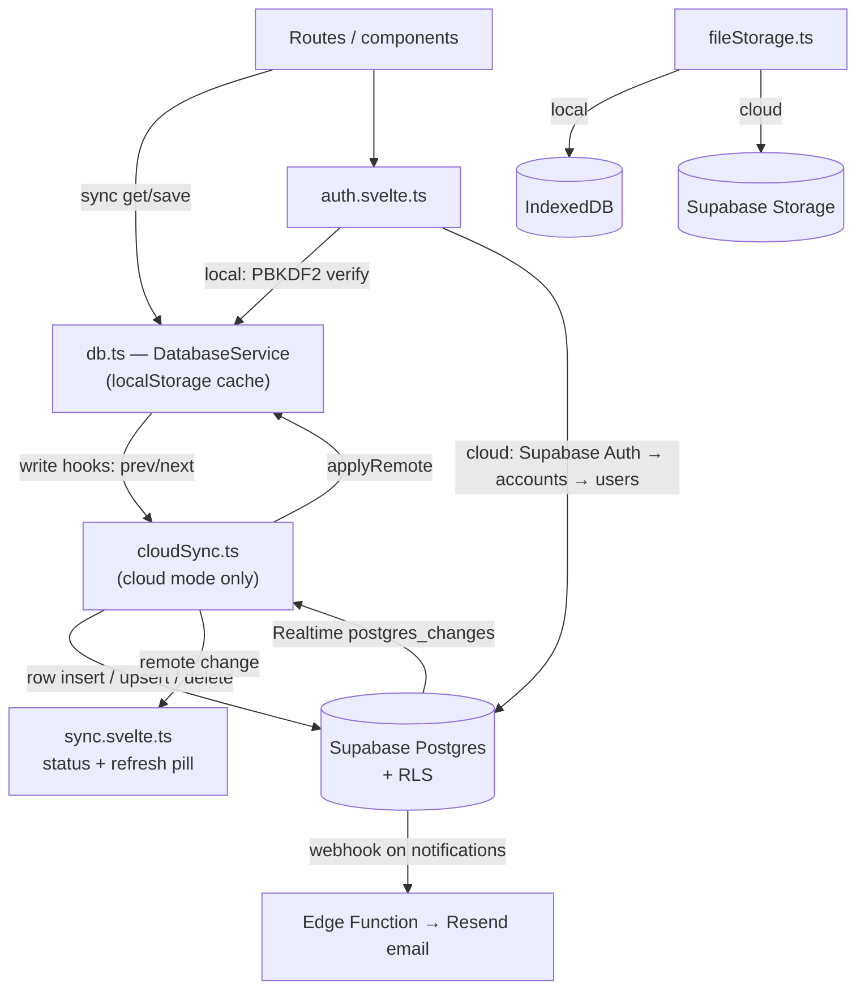

# TeamForge — Architecture & Delivery Log

> TeamForge is a SvelteKit web app for university capstone courses. It has three roles: **student**, **faculty** and **admin**. Students form teams and run projects (Kanban, milestones, weekly reports, files, discussion). Faculty supervise (approvals, reviews, attendance, analytics, reports, announcements). Admins manage the platform.
>
> This document describes the current state of the `mouly` branch: the architecture, what has been built, and what is still left.

---

## 1. Tech stack

| Layer | Choice |
|---|---|
| Framework | SvelteKit 2 + Svelte 5 (runes), client-rendered SPA (`ssr = false`) |
| Build / hosting | `@sveltejs/adapter-static` with `index.html` fallback → any static host |
| Styling | Tailwind CSS v4, design tokens in `src/routes/layout.css` (light and dark) |
| Motion | View Transitions API for route changes, CSS reveal/tilt actions, Lenis smooth scroll on the landing page |
| 3D | three.js, loaded lazily for `ForgeScene` (landing and auth pages) |
| Validation | zod schemas at the storage boundary (`src/lib/schemas.ts`) |
| Backend | Supabase: Auth, Postgres (RLS), Storage, Realtime, Edge Functions (**opt-in**, SDK loaded lazily) |
| Export | CSV (hand-rolled) and PDF (jsPDF + autotable, lazily loaded) |
| Tests / CI | Vitest (81 tests, incl. 21 database security tests on PGlite); GitHub Actions runs check, test and build |

---

## 2. Data flow



- **Local mode** (no `VITE_SUPABASE_*` env): `localStorage` is the source of truth, seeded with demo data. The Supabase SDK is never downloaded.
- **Cloud mode**: `localStorage` is a cache of Supabase. Each collection is a table with the record in `data jsonb`; the fields policies need (owner, project, role, member ids…) are generated columns derived by Postgres. Pages keep their synchronous API. Remote changes refresh the view automatically, unless the person is typing or has a dialog open; then a "Your team made changes · Refresh" pill appears instead.
- `db.saveX()` always saves a whole collection. `syncDiff.diffCollection` turns that into the minimum set of row writes. New rows are plain `INSERT`s, which need no read access to the row, so you can notify someone else. Changed rows are upserts. A rejected write reloads that table to roll back the optimistic change.

---

## 3. Security model

| Concern | Local mode | Cloud mode |
|---|---|---|
| Passwords | PBKDF2-SHA-256, 100k iterations, random salt; legacy SHA-256 hashes upgraded on login | Supabase Auth; a trigger strips any hash from user rows |
| Accounts without a hash | Refused (previously adopted the first password typed) | n/a |
| Brute force | 5 failures → 60 s lockout + progressive delay | The same, plus Supabase Auth per-IP rate limits |
| Sessions | 24 h absolute expiry, checked every 30 s and on tab focus | The same, layered on the Supabase session |
| Authorization | Client route guards per role | **Row Level Security** on every table. Role comes from `users`; project membership comes from the generated `member_ids` column. Guard triggers enforce old-versus-new rules (only faculty approve projects or review reports; invitees can only add themselves; nobody promotes themselves). Profiles are created by the `register_profile()` function, which checks roles against `app_config.bootstrap`. Faculty notes are staff-only and the audit log is append-only. |
| Files | IndexedDB, 20 MB cap | `project-files` bucket (private, 20 MB cap); upload allowed only for team members, for an existing `files` row |
| Shared machines | n/a | Sign-out clears the cached collections |

---

## 4. Route map

```
/                                   Landing: 3D hero, how it works, live figures
/auth                               Sign in / register (3D rail, strength meter, lockout)
/dashboard                          Role redirect
/dashboard/student[/team-finder|/ideas|/profile|/project/[id]]
/dashboard/faculty[/approvals|/milestones|/reviews|/meetings|/analytics|/reports|/activity-log|/announcements|/notes]
/dashboard/admin
```

---

## 5. Delivery log

### Stage A — Hardening (done)
Role guards, password verification, shared redirect helper, zod validation, reset and export/import.

### Stage B — Product features (done)
Explainable compatibility breakdown, real file storage, CSV reports, notification triggers, skill filters, admin analytics, faculty activity log.

### Stage C — Quality (done)
Vitest, branding, accessibility pass on Dialog and Tabs, CI, loading/empty/error states, mobile drawer.

### Stage D — Backend, security and redesign (done, this branch)
- **Backend (opt-in):** first built on Firebase, then replaced with **Supabase**:
  - a lazy SDK client and a realtime Postgres mirror;
  - Supabase Auth, with the email-confirmation flow handled;
  - self-provisioning demo accounts and one-time seeding;
  - Supabase Storage for files;
  - an Edge Function that emails notifications;
  - a SQL migration with RLS, guard triggers and validated functions, and `supabase/config.toml`.
- **Auth hardening:** PBKDF2 hashing, rate limiting, runtime session expiry, refusal of accounts with no hash, session copy without the hash.
- **Attendance capture:** faculty take a per-member register (present/late/excused/absent) on meetings. Analytics and the evaluation report show attendance rates, and each register is written to the audit log.
- **PDF export:** every Reports Hub card exports CSV or PDF.
- **Redesign:** minimal, flat surfaces with hairline borders; interactive three.js "team constellation" (drag, hover to highlight a team, click to re-match); view-transition page changes; scroll-reveal and pointer-tilt; animated notifications drawer; live sync indicator.
- **Bug fixes:**
  - Deleting a notification did not persist.
  - Records created in the same millisecond got the same `Date.now()` id; ids are now collision-safe.
  - The landing page's Lenis smooth-scroll loop kept running after leaving the page.
  - The dashboard auth guard looped on sign-out.
  - A failed upload left a file record with no bytes behind.
  - Faculty meetings list showed other departments' meetings.
- **Hosting:** adapter-static SPA build, OG image (`static/og-image.png`) with link-preview tags in `app.html`.

### Stage E — Project setup and dark-mode polish (done)
- Creating a project now asks for the **required skills** (chip input with suggestions), a **mentor** chosen from registered faculty (who is notified), and a **team size** (2–8). Invitations and acceptances stop once the team is full. The workspace shows which required skills the team already covers and suggests classmates who bring the missing ones. Approvals list your mentees first.
- The 3D scene has its own dark-mode tuning (brighter colours, additive glow, a soft backlight behind the sphere).

---

## 6. Known limits / next steps

- **The database is tested; the browser-to-Supabase path is not yet.** `supabase/tests/rls.test.ts` runs the real migration on PGlite and checks the security model as different users (21 tests). The client sync and auth code type-checks, but it hasn't been run against a live Supabase project, because this machine has no Docker for `supabase start`. Next step: link a project, run `npm run db:push`, set `.env`, and walk through sign-up, invite, approve and upload once.
- Every client loads whole tables (bounded by RLS, paged 1,000 rows at a time). That's fine for a department-sized deployment; larger ones should scope queries by project.
- Faculty self-registration is off unless allowed in `app_config.bootstrap`; there is no in-app admin approval queue yet.
- Set `og:image` in `src/app.html` to an absolute URL once the production domain is known.
