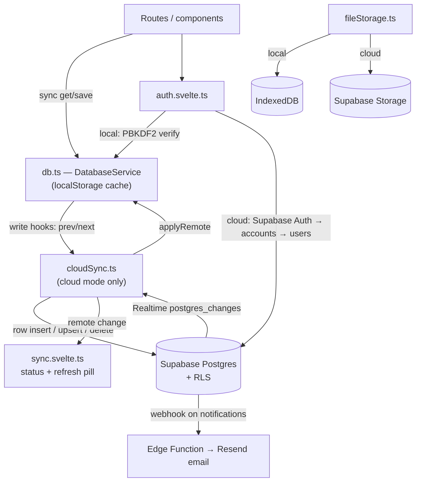

# Project-Sync — Architecture & Delivery Log

> Project-Sync is a SvelteKit web app for university capstone courses. It has three roles: **student**, **faculty** and **admin**. Students form teams and run projects (Kanban, milestones, weekly reports, files, discussion). Faculty supervise (approvals, reviews, attendance, analytics, reports, announcements). Admins manage the platform.
>
> This document describes the current state of the `mouly` branch: the architecture, what has been built, and what is still left.

---

## 1. Tech stack

| Layer | Choice |
|---|---|
| Framework | SvelteKit 2 + Svelte 5 (runes), client-rendered SPA (`ssr = false`) |
| Build / hosting | `@sveltejs/adapter-static` with `index.html` fallback → any static host |
| Styling | Tailwind CSS v4, design tokens in `src/routes/layout.css` (light and dark) |
| Motion | View Transitions API for route changes, CSS reveal/tilt actions, Lenis smooth scroll on the landing page |
| 3D | three.js, loaded lazily for `ForgeScene` (landing and auth pages) |
| Validation | zod schemas at the storage boundary (`src/lib/schemas.ts`) |
| Backend | Supabase: Auth, Postgres (RLS), Storage, Realtime, Edge Functions (**opt-in**, SDK loaded lazily) |
| Export | CSV (hand-rolled) and PDF (jsPDF + autotable, lazily loaded) |
| Tests / CI | Vitest (159 tests, incl. 21 database security tests on PGlite); GitHub Actions runs check, test and build |

---

## 2. Data flow


```mermaid
flowchart TD
    UI[Routes / components] -->|sync get/save| DB["db.ts — DatabaseService<br/>(localStorage cache)"]
    UI --> Auth["auth.svelte.ts"]
    DB -->|write hooks: prev/next| Sync["cloudSync.ts<br/>(cloud mode only)"]
    Sync -->|row insert / upsert / delete| FS[(Supabase Postgres<br/>+ RLS)]
    FS -->|Realtime postgres_changes| Sync -->|applyRemote| DB
    Sync -->|remote change| SyncState["sync.svelte.ts<br/>status + refresh pill"]
    Auth -->|local: PBKDF2 verify| DB
    Auth -->|cloud: Supabase Auth → accounts → users| FS
    Files["fileStorage.ts"] -->|local| IDB[(IndexedDB)]
    Files -->|cloud| GCS[(Supabase Storage)]
    FS -->|webhook on notifications| Mail["Edge Function → Resend email"]
```

- **Local mode** (no `VITE_SUPABASE_*` env): `localStorage` is the source of truth, seeded with demo data. The Supabase SDK is never downloaded.
- **Cloud mode**: `localStorage` is a cache of Supabase. Each collection is a table with the record in `data jsonb`; the fields policies need (owner, project, role, member ids…) are generated columns derived by Postgres. Pages keep their synchronous API. Remote changes refresh the view automatically, unless the person is typing or has a dialog open; then a "Your team made changes · Refresh" pill appears instead.
- `db.saveX()` always saves a whole collection. `syncDiff.diffCollection` turns that into the minimum set of row writes. New rows are plain `INSERT`s, which need no read access to the row, so you can notify someone else. Changed rows are upserts. A rejected write reloads that table to roll back the optimistic change.

---

## 3. Security model

| Concern | Local mode | Cloud mode |
|---|---|---|
| Passwords | PBKDF2-SHA-256, 100k iterations, random salt; legacy SHA-256 hashes upgraded on login | Supabase Auth; a trigger strips any hash from user rows |
| Accounts without a hash | Refused (previously adopted the first password typed) | n/a |
| Brute force | 5 failures → 60 s lockout + progressive delay | The same, plus Supabase Auth per-IP rate limits |
| Sessions | 24 h absolute expiry, checked every 30 s and on tab focus | The same, layered on the Supabase session |
| Authorization | Client route guards per role | **Row Level Security** on every table. Role comes from `users`; project membership comes from the generated `member_ids` column. Guard triggers enforce old-versus-new rules (only faculty approve projects or review reports; invitees can only add themselves; nobody promotes themselves). Profiles are created by the `register_profile()` function, which checks roles against `app_config.bootstrap`. Faculty notes are staff-only and the audit log is append-only. |
| Files | IndexedDB, 20 MB cap | `project-files` bucket (private, 20 MB cap); upload allowed only for team members, for an existing `files` row |
| Shared machines | n/a | Sign-out clears the cached collections |

---

## 4. Route map

```
/                                   Landing: 3D hero, how it works, live figures
/auth                               Sign in / register (3D rail, strength meter, lockout)
/dashboard                          Role redirect
/dashboard/student[/team-finder|/ideas|/profile|/project/[id]]
/dashboard/faculty[/approvals|/milestones|/reviews|/meetings|/analytics|/reports|/activity-log|/announcements|/notes]
/dashboard/admin
```

---

## 5. Delivery log

### Stage A — Hardening (done)
Role guards, password verification, shared redirect helper, zod validation, reset and export/import.

### Stage B — Product features (done)
Explainable compatibility breakdown, real file storage, CSV reports, notification triggers, skill filters, admin analytics, faculty activity log.

### Stage C — Quality (done)
Vitest, branding, accessibility pass on Dialog and Tabs, CI, loading/empty/error states, mobile drawer.

### Stage D — Backend, security and redesign (done, this branch)
- **Backend (opt-in):** first built on Firebase, then replaced with **Supabase**:
  - a lazy SDK client and a realtime Postgres mirror;
  - Supabase Auth, with the email-confirmation flow handled;
  - self-provisioning demo accounts and one-time seeding;
  - Supabase Storage for files;
  - an Edge Function that emails notifications;
  - a SQL migration with RLS, guard triggers and validated functions, and `supabase/config.toml`.
- **Auth hardening:** PBKDF2 hashing, rate limiting, runtime session expiry, refusal of accounts with no hash, session copy without the hash.
- **Attendance capture:** faculty take a per-member register (present/late/excused/absent) on meetings. Analytics and the evaluation report show attendance rates, and each register is written to the audit log.
- **PDF export:** every Reports Hub card exports CSV or PDF.
- **Redesign:** minimal, flat surfaces with hairline borders; interactive three.js "team constellation" (drag, hover to highlight a team, click to re-match); view-transition page changes; scroll-reveal and pointer-tilt; animated notifications drawer; live sync indicator.
- **Bug fixes:**
  - Deleting a notification did not persist.
  - Records created in the same millisecond got the same `Date.now()` id; ids are now collision-safe.
  - The landing page's Lenis smooth-scroll loop kept running after leaving the page.
  - The dashboard auth guard looped on sign-out.
  - A failed upload left a file record with no bytes behind.
  - Faculty meetings list showed other departments' meetings.
- **Hosting:** adapter-static SPA build, OG image (`static/og-image.png`) with link-preview tags in `app.html`.

### Stage E — Project setup and dark-mode polish (done)
- Creating a project now asks for the **required skills** (chip input with suggestions), a **mentor** chosen from registered faculty (who is notified), and a **team size** (2–8). Invitations and acceptances stop once the team is full. The workspace shows which required skills the team already covers and suggests classmates who bring the missing ones. Approvals list your mentees first.
- The 3D scene has its own dark-mode tuning (brighter colours, additive glow, a soft backlight behind the sphere).

---

### Stage F — Insight, board and matching (done)
- **Team risk score** (`utils/risk.ts`): an explainable 0–100 score per team from six factors (overdue milestones, overdue tasks, attendance, idle members, reporting gaps, schedule slip). Shown as badges on the faculty dashboard, which now ranks teams riskiest first, and as factor cards on Student Analytics.
- **Analytics charts** (`components/charts/`, hand-built SVG, no chart library): burndown with crosshair tooltip, task status by team, workload by member, and a 12-week activity heatmap, all scoped by a team filter. Tasks now record `createdAt`/`completedAt`, and milestones `completedAt`, to feed them.
- **Drag-and-drop Kanban** (`components/project/KanbanBoard.svelte`): drag between columns and reorder within one (`db.moveTask`, persisted `order`). The per-card status menu remains for keyboard, screen-reader and touch users; moves are announced in a live region.
- **Command palette** (Ctrl+K / ⌘K): fuzzy search over pages, projects, tasks, people and actions, with recents. Deep links: `?tab=&task=` on the project workspace, `?q=` on Team Finder, `?project=` on faculty Milestones.
- **Smarter teammate matching** (`utils/skillGraph.ts`, `utils/compatibility.ts`): a skill graph groups skills into families, so related skills count as half a match. The score rewards common ground, skill areas a teammate adds, and (when matching for a led project) coverage of the team's missing skills. The breakdown dialog explains every point. The workspace invite suggestions and Project Ideas scores use the same engine. This is a local, explainable model; it does not call an LLM.

### Stage G — Forge surfaces and motion (done)
A visual language built on the product's name: surfaces go from **blueprint** (dashed, drafting marks) to **heat** (an ember arc) to **quenched** (solid, calm). It lives in `src/routes/forge.css` and `src/lib/actions/forge.ts`, uses no new dependencies, and every effect has a reduced-motion fallback.
- **Cards** (`Card`): quench entrance (arrives glowing, cools as it settles, sequenced page-wide by `use:sequence`); on hover an ember arc runs the edge once, drafting marks open at the corners and the header gauge extends. Variants `blueprint` and `ember`. Live-data refreshes do not replay entrances.
- **Stat tiles** (`StatCard`): ingots with a hot corner, ghost icon, anneal sheen and an odometer figure (`Odometer`).
- **Task board**: tickets with a stub, perforation and punched notches, priority heat stripe (overdue high priority breathes), tilted drag ghost, clank on landing and a spark burst (larger and green into Completed); lanes run cold → quenched.
- **Team Finder**: dossier cards with a gauge dial (`MatchGauge`) that flip in 3D to the top match evidence (`DossierCard`); the hidden face is `inert` and focus follows the flip.
- **Transitions**: page changes slide by direction of travel with a spark scan; tabs have a molten indicator that stretches between tabs and panels slide in from that side; dialogs open out of a blur with an ember arc; solid buttons "ignite" (pointer heat, spring press, release pulse).
- **Landing page**: headline words rise white-hot and cool; the three steps are a scroll-linked stacking deck (blueprint → heat → forged, with a spinning approval stamp); stats roll on odometers; capabilities draw as blueprints and forge solid; ember cursor (desktop), magnetic CTAs and a scroll heat rail.

### Stage H — Profiles for every role (done)
- **One profile page** at `/dashboard/profile` for students, faculty and admins (the old `/dashboard/student/profile` redirects), linked from each role's nav and the sidebar's user block.
  - Everyone: picture, bio, pronouns, GitHub/LinkedIn/portfolio links.
  - Students: department, year, open-to-projects, skills, interests, past projects.
  - Faculty: title, office hours and room, areas of expertise, research interests, accepting-mentees switch and an optional mentee limit (with current load).
  - Admins: title.
  - A profile-strength checklist per role. Name, email and role stay read-only (administrator only).
- **Profile pictures** (`AvatarPicker`): ten preset cartoon characters bundled in `static/avatars/` (DiceBear "Adventurer", CC BY 4.0, see `CREDITS.md`), an uploaded photo positioned and zoomed in a round frame (drag, scroll, slider, arrow keys) then cropped to 256×256 WebP in the browser (a few KB), or initials only.
- **`db.updateOwnProfile`** accepts only the fields a role may edit and validates them (department list, year, lengths, https links, mentee limit 1–20, avatar must be a preset, a small PNG/JPEG/WebP data URL, or a DiceBear URL). Cloud mode is covered by the existing `users` policy (own row only; role and email guarded).
- **Live avatars** (`stores/people.svelte.ts`, `Avatar userId=`): a new picture shows everywhere at once, including records that stored an older copy (project members, posts, ideas, comments).
- **Mentor choice** shows each mentor's title, load and office hours; mentors who are full or not taking mentees are disabled, and `createProject` refuses them.
- Fixed: the demo seed arrays could be mutated in memory by the first save (`getStorage` now hands out copies).

### Stage I — Renamed to Project-Sync (done)
- Every user-facing name is now **Project-Sync**: page titles, wordmark, link-preview tags, manifest, PDF footers, notification emails, backup file names and messages.
- **New mark** (`BrandLogo.svelte`, `src/lib/assets/favicon.svg`, `static/icon.svg`): the chamfered tile now holds two arrows chasing round a project node. The favicon follows the OS light/dark setting; the inline logo follows the app theme, and its arrows turn half a revolution on hover. PNG app icons (`apple-touch-icon.png`, `icon-192.png`, `icon-512.png`, maskable) and a new `og-image.png` were generated from it.
- Deliberately unchanged, because renaming would break existing installs: the `teamforge_*` browser-storage keys (sessions and local data), the `@teamforge.edu` demo accounts (live logins in Supabase), migration file names, the realtime channel name, and the `TeamForge/` folder that Vercel builds from.

## 6. Known limits / next steps

- **The database is tested; the browser-to-Supabase path is not yet.** `supabase/tests/rls.test.ts` runs the real migration on PGlite and checks the security model as different users (21 tests). The client sync and auth code type-checks, but it hasn't been run against a live Supabase project, because this machine has no Docker for `supabase start`. Next step: link a project, run `npm run db:push`, set `.env`, and walk through sign-up, invite, approve and upload once.
- Every client loads whole tables (bounded by RLS, paged 1,000 rows at a time). That's fine for a department-sized deployment; larger ones should scope queries by project.
- Faculty self-registration is off unless allowed in `app_config.bootstrap`; there is no in-app admin approval queue yet.
- Set `og:image` in `src/app.html` to an absolute URL once the production domain is known.
